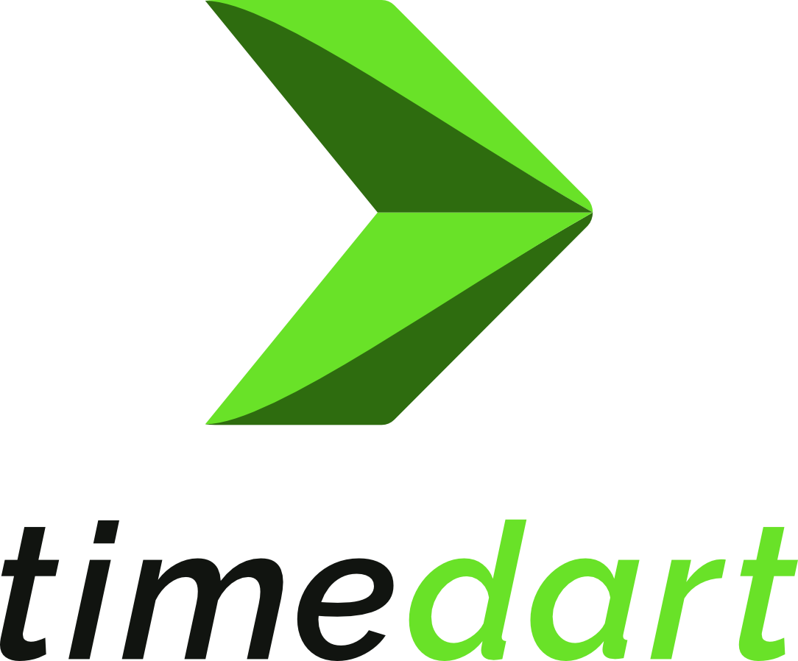
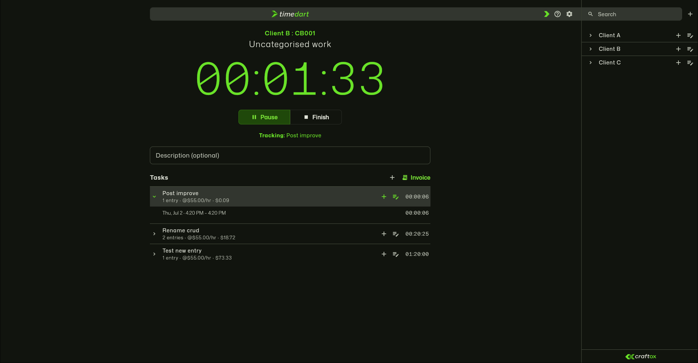
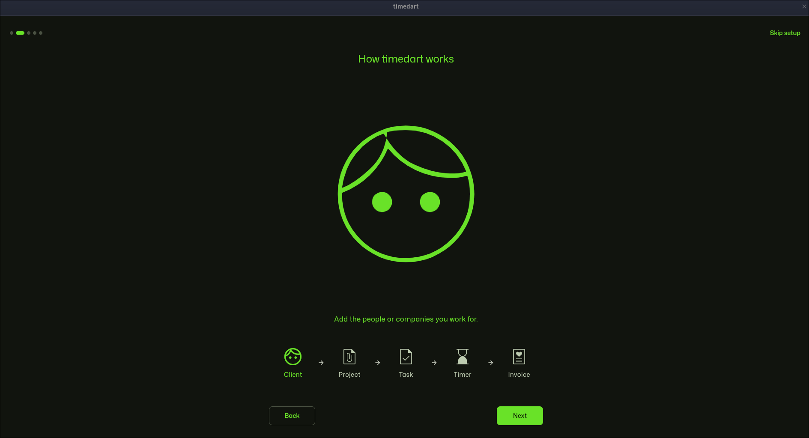
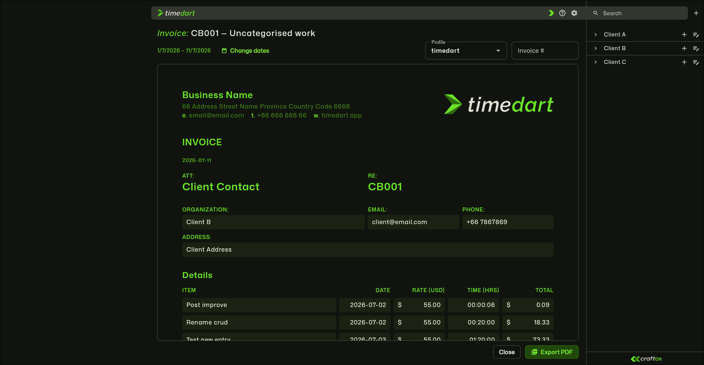
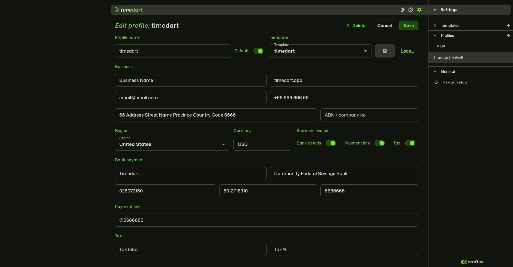
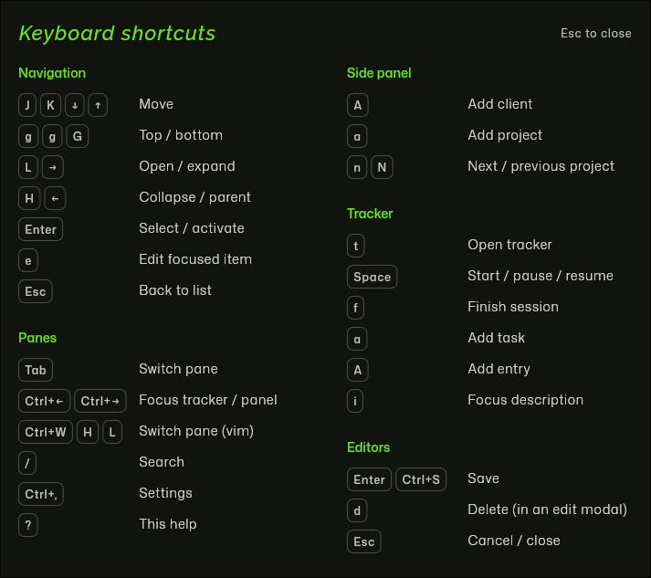

<p align="center">
  <picture>
    <source media="(prefers-color-scheme: dark)" srcset="assets/logo/timedart_logo_stacked_dark.png">
    
  </picture>
</p>

<p align="center">
  <strong>Track your hours the way you think about your work — client, project, task —<br>and turn them into an invoice in a couple of clicks.</strong>
</p>

<p align="center">
  
  
  
  
  <a href="https://github.com/craftox-labs/timedart/releases"></a>
  <a href="https://timedart.app"></a>
  <a href="https://demo.timedart.app"></a>
</p>

<p align="center">
  <strong>▶ <a href="https://timedart.app">Visit timedart.app</a></strong> — the website: what it is, a walkthrough, and screenshots.
</p>

<p align="center">
  <sub>Or <a href="https://demo.timedart.app">try the live web demo</a> — runs in your browser, no install; data never leaves your machine.</sub>
</p>

<p align="center">
  <a href="https://timedart.app">Website</a> ·
  <a href="#why-timedart">Why</a> ·
  <a href="#feature-tour">Features</a> ·
  <a href="#keyboard">Keyboard</a> ·
  <a href="https://demo.timedart.app">Demo</a> ·
  <a href="#download">Download</a> ·
  <a href="#roadmap">Roadmap</a>
</p>

<!-- SHOT: hero.png — the money shot. Main tracker view: side panel (clients →
     projects → tasks) + a running timer + the task list. Dark theme, ~1600px wide.
     See docs/media/SHOTLIST.md for the full brief. -->
<p align="center">
  
</p>

timedart is a fast, **local-first** time tracker for people who bill by the hour. Your data lives on
your machine, the timer is always one keypress away, and every recorded minute rolls straight up into a
per-project PDF invoice. Built with Flutter, it runs as a native desktop app and adapts down to a phone
from the same codebase.

## Why timedart

- **Structured, not scattered.** Organise work as **clients → projects → tasks**, and record each timed session as an **entry** under a task. Your history reads like your workload, not a flat log.
- **A timer that stays out of the way.** Start, pause, resume, and finish with a single key — from anywhere in the app. The running session survives while you edit a client, add a project, or preview an invoice — and it's persisted, so it even resumes at the right elapsed time after an app restart or crash.
- **Rates that just resolve.** Set a default rate on a client, override it per project or per task; every entry bills at the right rate automatically.
- **Invoices in seconds.** Pick a project and a date range, preview the itemised entries and total, and export a clean PDF — no spreadsheet round-trip.
- **Yours, on your disk.** Everything persists locally in SQLite. No account, no cloud — nothing leaves your machine. Back up or move it yourself with one-click export / import.
- **Keyboard-first.** The whole app is drivable without the mouse, vim-style. Press `?` any time for the full shortcut map.
- **One app, every screen.** A roomy two-pane layout on desktop folds to a single-pane phone layout with a bottom navigation bar — same features throughout.

## Screenshots

<!-- onboarding leads, full width -->
<p align="center">
  <br>
  <sub><b>A guided first run.</b> Learn the flow and set up your invoice identity.</sub>
</p>

<p align="center">
  <br>
  <sub><b>Invoices in seconds.</b> Hours roll straight into a branded, region-aware PDF.</sub>
</p>

<p align="center">
  <br>
  <sub><b>Make it yours.</b> Reusable templates and profiles for how invoices look and read.</sub>
</p>

<!-- keyboard closes it out -->
<p align="center">
  <br>
  <sub><b>Fly it from the keyboard.</b> Press <code>?</code> for the full shortcut map.</sub>
</p>

## Feature tour

- **First-run onboarding** — a brief branded intro on launch, then a skippable setup that explains how timedart works and captures your business identity (name, logo, email) and region — which auto-sets your currency and tax label — straight into your default invoice profile. Re-run it any time from **Settings → General**.
- **Timer** — `hh:mm:ss` count-up bound to a task, with start / pause / resume / finish. Name a session or let it inherit the task title. The active timer is persisted, so it survives an app restart or crash and resumes where it left off.
- **Clients, projects & tasks** — full create / edit / delete for each, in quick modal editors. Deletes are guarded against erasing billable history, with a deliberate, count-warned cascade for when you do want a whole branch gone. **Archive** finished clients or projects to tuck them out of the active lists while keeping their history for invoicing — reversible any time via **Show archived**.
- **Entries** — adjust the task, note, start time, and duration of any recorded segment after the fact.
- **Invoicing** — per-project, date-ranged, itemised at the effective rate, exported to a branded PDF sized to your region (A4, or US Letter for a US profile). Pick the profile and set an invoice number at export; the date range is chosen in a compact modal.
- **Invoice branding** — design how invoices look and read: reusable **templates** (colours, logo, font) and **profiles** (business identity, region-aware bank / payment details, currency, optional tax) that each carry a template. Manage them under **Settings**: selecting one opens a read-only preview first, with an Edit action that reveals the form (protected by an unsaved-changes prompt if you navigate away mid-edit).
- **Backup & restore** — export your entire database to a portable JSON file and import it on any install (**Settings → General**). Import automatically repairs orphaned rows from older data.
- **Adaptive UI** — persistent side panel + content pane when there's room; on phones, a bottom navigation bar with the client/project (and settings) lists in a slide-up panel.
- **Design** — a considered Material 3 theme in the timedart green, the Outfit typeface throughout (Raleway for headings), and a single design-token source so it stays consistent.

## Keyboard

timedart is built to be flown from the keyboard. Navigation is identical across the side panel and the tracker, so the same keys work wherever your cursor is.

| Keys | Action |
| --- | --- |
| `j` / `k` · `↓` / `↑` | move the cursor |
| `gg` / `G` | jump to first / last |
| `l` / `→` | open / expand |
| `h` / `←` | collapse / go to parent |
| `Enter` | select / activate |
| `e` | edit the focused item |
| `Tab` · `Ctrl`+`←`/`→` · `Ctrl-w` `h`/`l` | switch panes |
| `/` | search |
| `Ctrl`+`,` | open Settings |
| `Space` | start / pause / resume the timer (from any pane) |
| `f` · `i` | finish · focus the description |
| `a` / `A` | add (project / client in the panel · task / entry in the tracker) |
| `d` | delete, from inside an edit modal |
| `Ctrl`+`S` · `Esc` | save · cancel in any editor |
| `?` | show the full shortcut overlay |

> **In the web demo, some shortcuts may not reach the app.** Browser extensions that bind keys —
> [Vimium](https://vimium.github.io/) and similar — intercept single-key presses like `?`, `f`, and
> `j`/`k` before the page sees them. The keyboard experience is complete in the desktop build; on the
> web, disable such extensions for the demo site (or just use the mouse).

## Command-line interface

A companion `timedart` CLI drives the **same local database as the app** — start
and stop the timer, log and edit entries, manage clients / projects / tasks, and
pull time reports from the terminal. A timer you start in the CLI shows up in the
open app within a second, and vice versa.

It's **agent-ready**: every command has a `--json` mode and a stable exit code,
and the binary carries its own instructions — an LLM/agent can learn the whole
tool by running `timedart guide` (or `timedart help --json` for a machine-readable
command map).

Download the `timedart-cli-<platform>` archive from the
[Releases page](https://github.com/craftox-labs/timedart/releases), unpack it
(keep its `bin/` and `lib/` together), and put `bin/timedart` on your PATH:

```sh
timedart --version
timedart timer start -p "Acme Website" -t Design
timedart log -p "Acme Website" -t Design -D 90m -d "spec review"
timedart report --since 2026-07-01
```

Full reference: `timedart guide`, or the [docs](https://timedart.app).

## Download

**timedart is in open beta (`v0.9.0-beta`).** Grab a build from the
[**Releases page**](https://github.com/craftox-labs/timedart/releases):

| Platform | Download | First launch |
|---|---|---|
| **Linux** | `AppImage` or `tar.gz` | `chmod +x`, run — no install |
| **Windows** | portable `.zip` | SmartScreen → More info → Run anyway |
| **macOS** | universal `.zip` (Intel + Apple Silicon) | right-click → Open (unsigned) |
| **Android** | `.apk` | allow install from unknown sources |

Beta builds are unsigned (bar the Android upload key), so your OS asks you to confirm the first
launch — that's expected for a direct download, not a problem with the app. Data never leaves your
machine. Each release ships a `SHA256SUMS` file — verify with `sha256sum -c SHA256SUMS`.

The companion CLI ships as a separate `timedart-cli-<platform>` archive on the same page — see
[Command-line interface](#command-line-interface).

> Pre-1.0 while in beta: the local database format may still change between versions.

## Uninstalling

Nothing is installed system-wide, so removing timedart is quick and complete — handy if you're
just helping test it.

1. **Delete the app:** remove the AppImage / extracted folder (Linux, Windows), drag the app to the
   Trash (macOS), or uninstall the APK (Android).
2. **Delete your data folder** (skip on Android — it's cleared automatically on uninstall):

   | Platform | Data folder |
   |---|---|
   | **Linux** | `~/.local/share/timedart/` |
   | **macOS** | `~/Library/Application Support/timedart/` |
   | **Windows** | `%APPDATA%\timedart\` |
   | **Android** | removed automatically on uninstall |

Exported backups and PDFs live wherever you saved them — remove those separately. Want to keep your
data? **Export** it first (in-app **Settings → Data**, or see the [docs](https://timedart.app)).

## Build from source

Requires the Flutter SDK ([install guide](https://docs.flutter.dev/get-started/install)).

```sh
flutter pub get
flutter run -d linux      # native desktop (primary target)
flutter run -d chrome     # web, for a quick demo
flutter analyze           # static analysis (should be clean)
flutter test              # unit tests
flutter build linux       # release build
```

For iterative work there's `./dev.sh`: it runs `build_runner watch` (regenerating `*.g.dart` from
drift on save) alongside `flutter run -d linux`, and hot-reloads on changes under `lib/`.

The database lives in the platform data directory (`~/.local/share/timedart/` on Linux), not the
project folder.

## Roadmap

Core is complete and in daily-driver shape: first-run onboarding; persistent tracking across clients,
projects, and tasks; full editing everywhere; per-project PDF invoices with customisable, region-aware
branding; and end-to-end keyboard control. Next on the horizon:

- PDF polish — print-safe margins.
- Stored, immutable invoice snapshots.
- A richer, illustrated "how it works" step in onboarding.
- **Optional cross-device sync** — self-hostable and opt-in; the app stays fully local by default.
- Ongoing design polish.

<details>
<summary><b>Under the hood</b></summary>

Flutter + [drift](https://drift.simonbinder.eu) (SQLite) with foreign keys enforced, so deletes can
never orphan data. Organised **feature-first** — each feature owns its widgets, with shared
primitives and design tokens pulled out:

```
lib/
├── main.dart              wires the database into the root gate + adaptive shell
├── constants/             design tokens, Material 3 theme, formatting helpers
├── data/database.dart     drift tables + queries (Clients / Projects / Tasks / TimeEntries
│                          · invoice Templates / Profiles · AppSettings · ActiveTimer)
│   data/backup.dart        export / import (portable JSON snapshot)
├── features/
│   ├── onboarding/        first-run gate, startup intro, stepped setup wizard
│   ├── shell/             adaptive master–detail shell, side panel, Settings panel, shortcut overlay
│   ├── tracker/           timer, task list, task/entry editors
│   ├── clients/ · projects/   client & project editors
│   ├── invoices/          per-project PDF invoicing + invoice branding
│   │                      (template / profile editors, shared live A4 preview)
│   └── deletions.dart     shared, guarded delete flows
└── widgets/               shared UI primitives
```

`main.dart` mounts a root gate that plays the intro, runs first-run onboarding when needed, then hands
off to the shell. The shell holds the selected project (what the timer records against) and the content
pane's state. Client / project / task / entry editing happens in adaptive modals over the pane; invoicing
and the branding editors live in the content pane itself — a Settings mode that swaps the side panel for
Templates / Profiles / General sections, driven by the same keyboard navigation. Opening a template or
profile shows it read-only first; Edit reveals the form in place, and leaving with unsaved changes
prompts to save, discard, or stay.

</details>

## Development

Work lands one change per branch, reviewed as a PR and squash-merged so `main` stays a clean,
linear history. `flutter analyze` and `flutter test` should both pass before every PR.

## License

timedart is open source under the [MIT License](LICENSE) — © 2026 Craftox.
